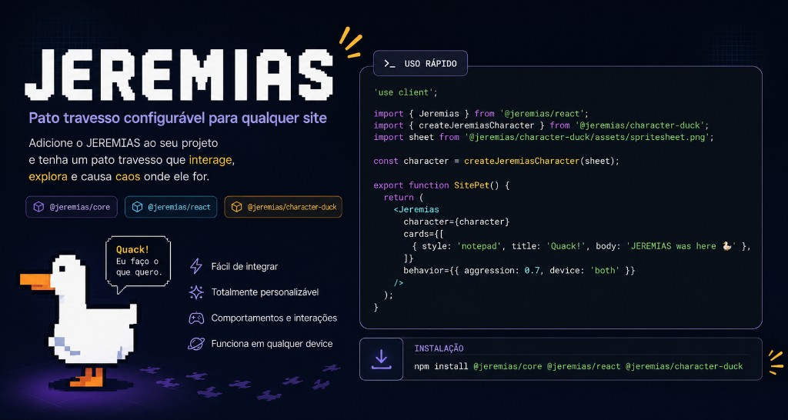

# JEREMIAS

<p align="center">
  
</p>

Pato travesso configurável para qualquer site. Funciona com React, Next.js, Vite ou JavaScript puro.

O JEREMIAS aparece na página, traz **cards flutuantes** (Reddit, Notepad, Facebook, Orkut, Discord), **arrasta elementos** da DOM, **persegue o cursor** e pode **roubá-lo**. Tudo configurável por props ou API imperativa.

## Pacotes npm

| Pacote | Descrição |
|--------|-----------|
| [`@duckjeremias/core`](./packages/core) | Engine (canvas, overlay, tasks, config) |
| [`@duckjeremias/react`](./packages/react) | Componente `<Jeremias />` (`'use client'`) |
| [`@duckjeremias/character-duck`](./packages/character-duck) | Spritesheet + `createJeremiasCharacter()` |

## Instalação

```bash
npm install @duckjeremias/core @duckjeremias/react @duckjeremias/character-duck
```

Só vanilla (sem React):

```bash
npm install @duckjeremias/core @duckjeremias/character-duck
```

## Início rápido (React / Next.js)

```tsx
'use client';

import { Jeremias } from '@duckjeremias/react';
import { createJeremiasCharacter } from '@duckjeremias/character-duck';
import sheet from '@duckjeremias/character-duck/assets/spritesheet.png';

const character = createJeremiasCharacter(sheet);

export function SitePet() {
  return (
    <Jeremias
      character={character}
      cards={[
        { style: 'notepad', title: 'Quack!', body: 'JEREMIAS was here 🦆' },
      ]}
      behavior={{
        aggression: 0.7,
        targets: ['#pricing', 'button.cta'],
        stealCursor: false,
        device: 'desktop',
      }}
    />
  );
}
```

## Início rápido (Vanilla JS)

```ts
import { createJeremias } from '@duckjeremias/core';
import { createJeremiasCharacter } from '@duckjeremias/character-duck';

const character = createJeremiasCharacter('/spritesheet.png');

const jeremias = createJeremias({
  character,
  cards: [{ style: 'notepad', title: 'Olá', body: 'Quack' }],
  behavior: { device: 'both' },
});

// depois: jeremias.destroy();
```

---

## Configuração completa

Toda instância aceita um `JeremiasConfig`. No React, as mesmas opções viram props do `<Jeremias />`.

### Visão geral

| Campo | Obrigatório | Default | Descrição |
|-------|-------------|---------|-----------|
| `character` | **sim** | n/a | `CharacterPack` (sprites + animações) |
| `cards` | não | `[]` | Cards flutuantes personalizados |
| `behavior` | não | ver tabela | Caos, alvos, cursor, dispositivo |
| `tasks` | não | ver tabela | Quais comportamentos estão ativos |
| `speed` | não | ver tabela | Velocidades em px/s |
| `render` | não | ver tabela | Escala e z-index |
| `mount` | não | `document.body` | Onde montar a camada |
| `dismissible` | não | `true` | Botão + ESC 1,5s para dispensar |
| `onDismiss` | não | n/a | Callback ao destruir |

> **Importante:** se `cards` estiver vazio, nenhum card aparece. Nada é injetado por padrão: você define os cards no seu site.

Props legadas ainda funcionam: `aggression`, `targets`, `notes` (prefira `behavior` e `cards`).

---

### `character`

Objeto `CharacterPack` com spritesheet e mapa de animações.

```ts
import { createJeremiasCharacter } from '@duckjeremias/character-duck';
import sheet from '@duckjeremias/character-duck/assets/spritesheet.png';

const character = createJeremiasCharacter(sheet);
```

| Campo | Tipo | Descrição |
|-------|------|-----------|
| `id` | `string` | Identificador único |
| `displayName` | `string` | Nome exibido |
| `spritesheet` | `string` | URL da imagem |
| `frameWidth` / `frameHeight` | `number` | Tamanho de cada frame (48×48 no duck) |
| `animations` | `Record<string, AnimationDef>` | `{ row, frames, fps }` por animação |

---

### `cards` (cards flutuantes)

Array de `JeremiasCard` ou strings simples.

**Estilos disponíveis:** `'reddit' | 'notepad' | 'facebook' | 'orkut' | 'discord'`

```ts
cards: [
  {
    style: 'reddit',
    subreddit: 'r/meusite',
    title: 'Título do post',
    body: 'Texto com\nquebras de linha',
    author: 'seu_usuario',
    flair: 'Meme',
    upvotes: 420,
    comments: 12,
    image: '/foto.png',      // opcional
    imageAlt: 'Descrição',   // opcional
  },
  'Linha única vira card rotativo entre estilos',
]
```

**Comportamento dos cards**

- Aparecem centralizados na tela (sem cortar nas bordas).
- Arrastáveis pelo header (estilo Fluxbox).
- Fechar um card pode deixar o JEREMIAS bravo e roubar o cursor (se `stealCursor` estiver ativo).

---

### `behavior`

| Opção | Default | Descrição |
|-------|---------|-----------|
| `aggression` | `0.65` | Nível de caos (`0`–`1`). Com `prefers-reduced-motion`, cap em `0.25` |
| `targets` | `[]` | Seletores CSS que o pato pode **correr e arrastar** |
| `allowOffscreenDrag` | `true` | Elementos da página podem sair da viewport ao serem arrastados |
| `offscreenDragChance` | `0.55` | Chance (`0`–`1`) de destino fora da tela (só se `allowOffscreenDrag`) |
| `stealCursor` | `true` | Esconde o cursor real e usa um cursor fake preso ao bico |
| `device` | `'both'` | `'desktop'` \| `'mobile'` \| `'both'`: onde o pato aparece |
| `mobileBreakpoint` | `768` | Largura máxima (px) considerada mobile |

Se `device` não corresponde ao dispositivo atual, `createJeremias` retorna uma instância noop (sem efeito).

```ts
behavior: {
  aggression: 0.8,
  targets: ['#hero', '.pricing-card', 'button.buy'],
  allowOffscreenDrag: false,
  stealCursor: false,
  device: 'desktop',
}
```

---

### `tasks`

| Opção | Default | Descrição |
|-------|---------|-----------|
| `wander` | `true` | Vaga pela página |
| `chaseCursor` | `true` | Persegue o cursor |
| `dragCursor` | `true`* | Persegue e arrasta o cursor |
| `grabTarget` | `true`† | Corre até `behavior.targets` e arrasta |
| `showCards` | `true` | Traz cards flutuantes |

\* `dragCursor` só funciona se `behavior.stealCursor === true`.

† `grabTarget` default `true` apenas quando `behavior.targets` tem itens.

```ts
tasks: {
  wander: true,
  chaseCursor: true,
  dragCursor: false,
  grabTarget: true,
  showCards: true,
}
```

---

### `speed`

Velocidades em **pixels por segundo**.

| Opção | Default |
|-------|---------|
| `walk` | `95` |
| `run` | `210` |
| `charge` | `360` |
| `fly` | `520` |

```ts
speed: { walk: 80, run: 180, fly: 450 }
```

---

### `render`

| Opção | Default | Descrição |
|-------|---------|-----------|
| `scale` | `1.38` | Escala do sprite no canvas |
| `layerZIndex` | `2147483645` | z-index da camada principal |

---

### `dismissible` e `onDismiss`

- **`dismissible: true`** (default): botão “Dismiss JEREMIAS” + segurar ESC por 1,5s.
- **`onDismiss`**: chamado quando a instância é destruída.

---

## API imperativa

Disponível via `ref` no React ou retorno de `createJeremias()`:

```ts
interface JeremiasInstance {
  destroy(): void;
  setAggression(value: number): void;
  grabElement(target: string | HTMLElement): void;
}
```

**React**

```tsx
const ref = useRef<JeremiasInstance>(null);

ref.current?.grabElement('#pricing');
ref.current?.setAggression(0.3);
ref.current?.destroy();
```

**Props extras (React)**

| Prop | Default | Descrição |
|------|---------|-----------|
| `enabled` | `true` | Se `false`, não monta o engine |
| `className` | n/a | Classe do wrapper fixo |
| `mount` | wrapper interno | Se passado, componente retorna `null` |

---

## Estrutura do monorepo

Convenção: **kebab-case** em pastas, scripts e assets.

```
jeremias/
├── packages/
│   ├── core/
│   │   └── src/
│   │       ├── cards/        # resolve-cards
│   │       ├── config/       # defaults, resolve-config, device
│   │       ├── engine.ts
│   │       ├── overlay.ts
│   │       ├── animator.ts
│   │       ├── types.ts
│   │       └── windows-cursor.ts
│   ├── react/
│   │   └── src/Jeremias.tsx
│   └── character-duck/
│       ├── assets/
│       │   ├── credits.md
│       │   ├── spritesheet.png          # gerado no build
│       │   └── source/
│       │       └── sprite-sheet.png     # fonte Etienne Pouvreau
│       └── scripts/
│           └── generate-spritesheet.mjs
├── LICENSE
├── README.md
└── package.json
```

### Exports públicos (`@duckjeremias/core`)

```ts
// Factory
createJeremias(config)
JeremiasEngine          // uso avançado

// Config
resolveJeremiasConfig
isDeviceVisible
DEFAULT_BEHAVIOR
DEFAULT_TASKS
DEFAULT_SPEED
DEFAULT_RENDER

// Cards
resolveCards

// Tipos
JeremiasConfig, JeremiasInstance, JeremiasCard, CharacterPack, …
```

---

## Desenvolvimento

```bash
git clone https://github.com/whoisdon/jeremias.git
cd jeremias
npm install
npm run build
npm run typecheck
```

---

## Sprites (créditos)

Arte: **Pixel Duck Anim SpriteSheet** por **Etienne Pouvreau**. Detalhes em [`packages/character-duck/assets/credits.md`](./packages/character-duck/assets/credits.md).

- Fonte: `packages/character-duck/assets/source/sprite-sheet.png`
- Build: `npm run build -w @duckjeremias/character-duck` gera `assets/spritesheet.png`

---

## Licença

Código: **MIT**. Ver [LICENSE](./LICENSE) (copyright **JEREMIAS contributors**).

Sprites de terceiros: crédito obrigatório conforme `credits.md` do pacote `character-duck`.
