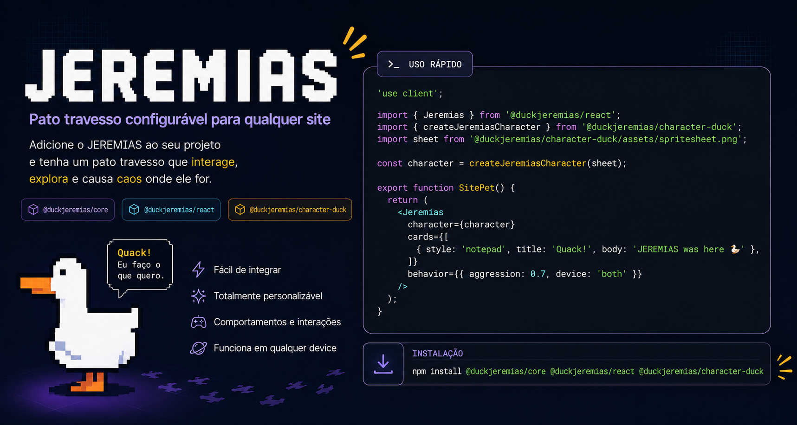

# @duckjeremias/core

<p align="center">
  
</p>

Engine do **JEREMIAS** — pato travesso em canvas com cards flutuantes, arrasto de elementos DOM, perseguição de cursor e overlay.

Funciona em qualquer site com JavaScript. Para React, use [`@duckjeremias/react`](https://www.npmjs.com/package/@duckjeremias/react).

## Instalação

```bash
npm install @duckjeremias/core @duckjeremias/character-duck
```

## Uso rápido

```ts
import { createJeremias } from '@duckjeremias/core';
import { createJeremiasCharacter } from '@duckjeremias/character-duck';
import sheet from '@duckjeremias/character-duck/assets/spritesheet.png';

const jeremias = createJeremias({
  character: createJeremiasCharacter(sheet),
  cards: [
    { style: 'notepad', title: 'Quack!', body: 'JEREMIAS was here 🦆' },
  ],
  behavior: {
    aggression: 0.7,
    targets: ['#pricing', 'button.cta'],
    stealCursor: false,
    device: 'desktop',
  },
});

// jeremias.destroy();
```

## O que este pacote faz

- Renderiza o personagem em `<canvas>` com animações por spritesheet
- Spawna **cards flutuantes** (Reddit, Notepad, Facebook, Orkut, Discord, X, etc.)
- Executa **tasks** configuráveis: trazer cards, arrastar elementos, perseguir cursor, voar
- Expõe API imperativa (`setAggression`, `grabElement`, `destroy`)

## Exports principais

| Export | Descrição |
|--------|-----------|
| `createJeremias(config)` | Cria a instância |
| `JeremiasEngine` | Classe da engine (uso avançado) |
| `resolveJeremiasConfig` | Resolve defaults + props |
| `resolveCards` | Normaliza lista de cards |
| `DEFAULT_BEHAVIOR`, `DEFAULT_TASKS`, `DEFAULT_SPEED`, `DEFAULT_RENDER` | Defaults |
| `isDeviceVisible` | Filtra por desktop/mobile |

Tipos: `JeremiasConfig`, `JeremiasInstance`, `JeremiasCard`, `CharacterPack`, `PanelStyle`, etc.

## Configuração

| Campo | Obrigatório | Descrição |
|-------|-------------|-----------|
| `character` | sim | `CharacterPack` (sprites + animações) |
| `cards` | não | Cards flutuantes — se vazio, nenhum card aparece |
| `behavior` | não | `aggression`, `targets`, `stealCursor`, `device` |
| `tasks` | não | Liga/desliga `bringNote`, `grabTarget`, `chaseCursor`, `fly` |
| `speed` | não | Velocidades em px/s |
| `render` | não | Escala e z-index da camada |
| `mount` | não | Onde montar (default: `document.body`) |
| `dismissible` | não | Botão + ESC 1,5s para dispensar |

Documentação completa: [monorepo JEREMIAS](https://github.com/whoisdon/jeremias#readme)

## Licença

MIT — [LICENSE](https://github.com/whoisdon/jeremias/blob/main/LICENSE)
